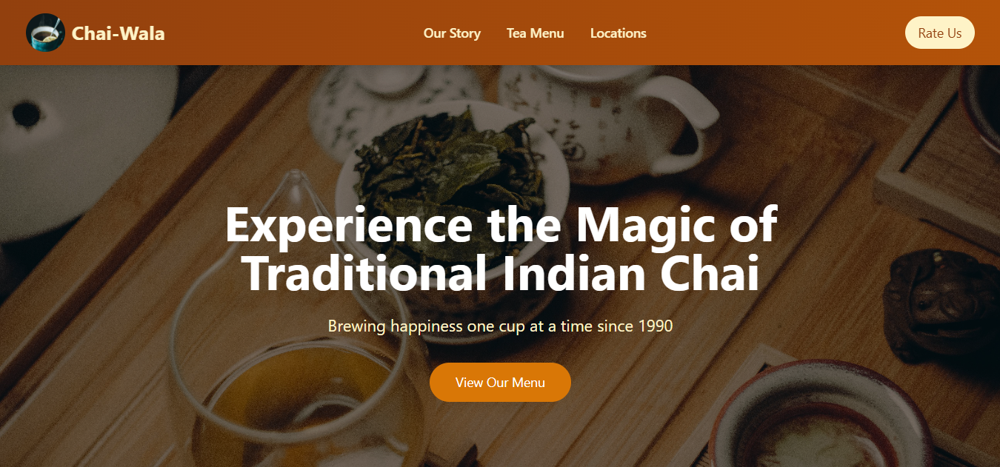
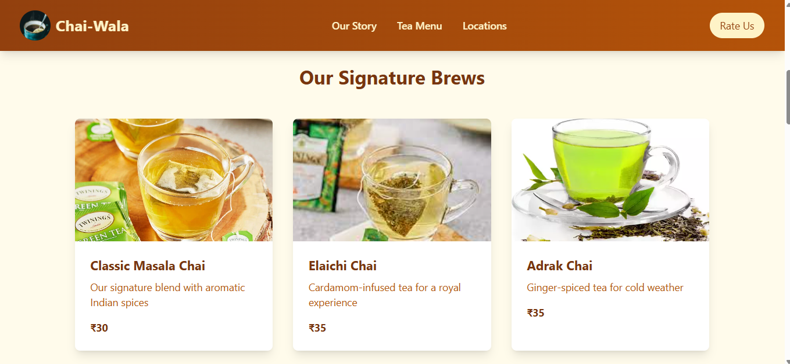
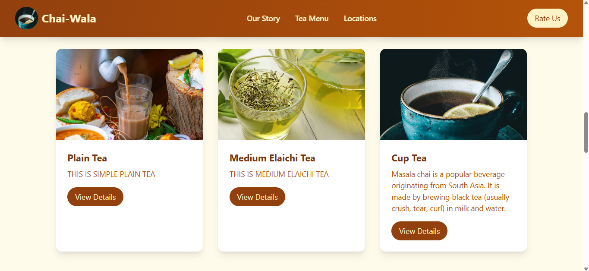
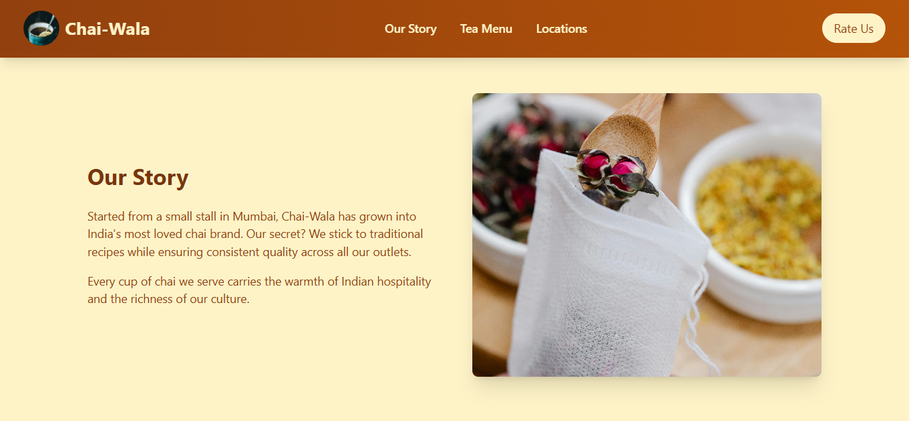
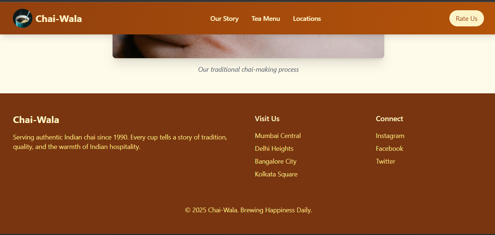
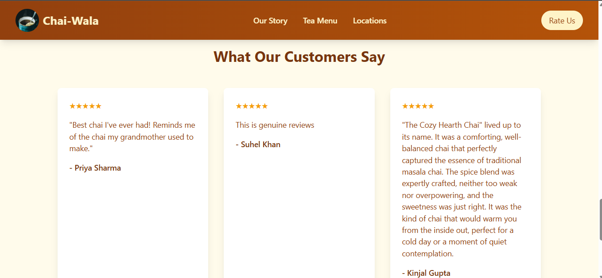
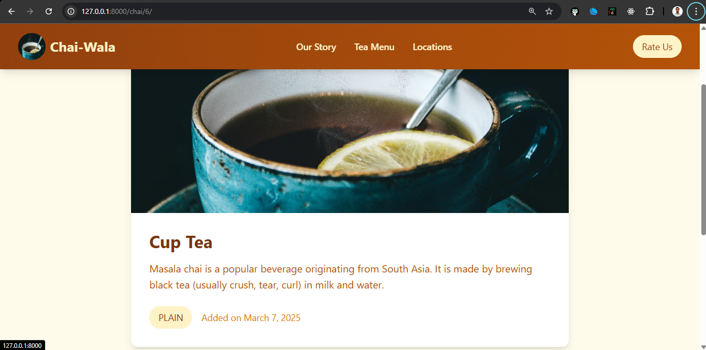
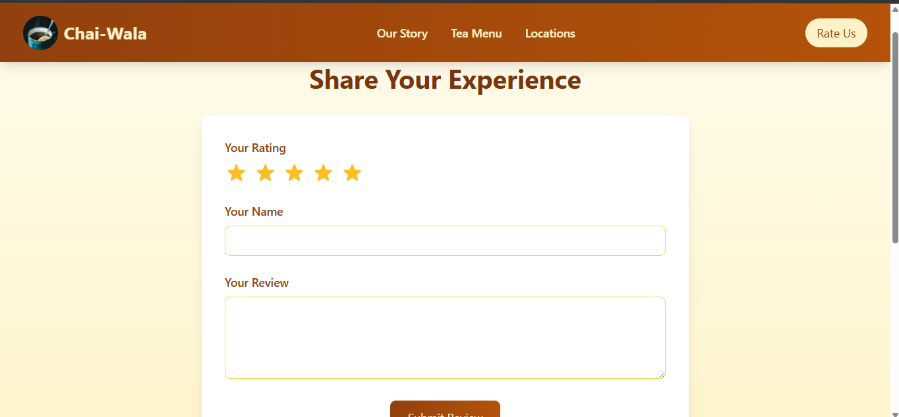
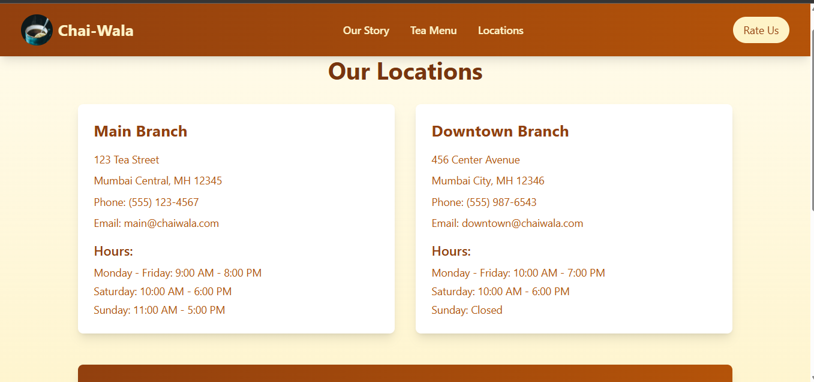
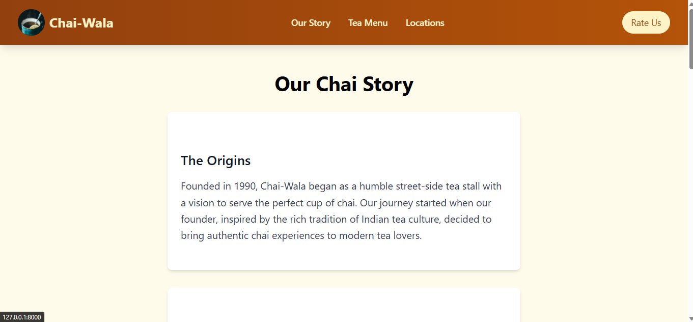

<h1 align="center">Chai-Wala Store</h1>

# Chai-Wala: Tea House Web Application

## Project Overview

Chai-Wala is a full-stack web application built with Django and TailwindCSS, designed to showcase and manage a tea house's online presence. The application features a responsive design, dynamic content management, and interactive user features.

## Technical Stack

### Backend

- **Django 5.1.7**: Core web framework
- **SQLite**: Database management
- **Pillow**: Image processing library for handling tea variety images
- **Python 3.x**: Programming language

### Frontend

- **TailwindCSS 3.x**: Utility-first CSS framework
- **Django Templates**: Server-side rendering
- **JavaScript**: Interactive features
- **HTML5/CSS3**: Structure and styling

## Core Features

### 1. Dynamic Tea Catalog

- Model: `ChaiVariety`
- Fields:
  - name (CharField)
  - image (ImageField)
  - date_added (DateTimeField)
  - type (CharField with choices)
  - description (TextField)
  - price (IntegerField)

### 2. Review System

- Model: `Review`
- Features:
  - Star rating (1-5)
  - Review text
  - Author name
  - Flash messages for submission feedback
  - Interactive star rating selection

### 3. Content Management

- Django Admin integration
- Image upload handling
- Dynamic content updates

## Project Structure

```
chairaurdjango/
├── chai/                   # Main application
│   ├── models.py          # Database models
│   ├── views.py           # View logic
│   └── templates/         # Tea-specific templates
├── website/               # Website core
│   ├── views.py           # Page handlers
│   └── templates/         # Page templates
├── static/                # Static files
│   ├── css/               # Custom CSS
│   └── images/            # Media files
└── theme/                 # TailwindCSS configuration
```

## Key Features Implementation

### 1. Tea Variety Management

```python
# filepath: c:\Users\suhel\Documents\GitHub\Django-Learning\chairaurdjango\chai\models.py
class ChaiVariety(models.Model):
    CHAI_TYPE_CHOICES = [
        ('ML', 'MASALA'),
        ('GR', 'GINGER'),
        ('KL', 'KIWI'),
        ('PL', 'PLAIN'),
        ('EL', 'ELAICHI'),
    ]
    name = models.CharField(max_length=100)
    image = models.ImageField(upload_to='chais/')
    date_added = models.DateTimeField(default=timezone.now)
    type = models.CharField(max_length=2, choices=CHAI_TYPE_CHOICES, default='ML')
    description = models.TextField(default='')
    price = models.IntegerField(default=20)

    def __str__(self):
        return self.name
```

### 2. Review System

```python
# filepath: c:\Users\suhel\Documents\GitHub\Django-Learning\chairaurdjango\chai\models.py
class Review(models.Model):
    review_text = models.TextField()
    rating = models.IntegerField(choices=[(i, i) for i in range(1, 6)])
    author = models.CharField(max_length=100)

    def __str__(self):
        return self.author + str(self.rating)
```

## URL Structure

- `/`: Homepage with featured teas
- `/about/`: Company story
- `/menu/`: Complete tea menu
- `/review/`: Customer review submission
- `/locations/`: Store locations
- `/chai/<int:chai_id>/`: Individual tea details

## Styling

- Customized TailwindCSS configuration
- Responsive design
- Color scheme:
  - Primary: Amber
  - Secondary: Green (for success messages)
  - Accent: White/Gray

## Security Features

- CSRF protection
- Form validation
- Secure file uploads
- Django security middlewares

## Performance Optimizations

- Lazy loading of images
- Efficient database queries
- Minified CSS/JS
- Browser reload support for development

## Installation and Setup

1. Clone the repository:

```bash
git clone [repository-url]
```

2. Install dependencies:

```bash
pip install -r requirements.txt
npm install
```

3. Configure environment:

```python
# Update settings.py with your configurations
DEBUG = True
SECRET_KEY = 'your-secret-key'
```

4. Run migrations:

```bash
python manage.py migrate
```

5. Start development server:

```bash
python manage.py runserver
```

## Contributing

1. Fork the repository
2. Create a feature branch
3. Commit changes
4. Push to the branch
5. Create a Pull Request

## Future Enhancements

1. User authentication
2. Online ordering system
3. Payment integration
4. API development
5. Social media integration


## Snapshot

### Homepage







### Menu Page


#### Details


### Review Page



### Locations Page



### About Us Page




## License

MIT License

## 📫 Let's Connect

- GitHub: [SuhelKhanCA](https://github.com/SuhelKhanCA)
- LinkedIn: [Suhel Khan](https://www.linkedin.com/in/suhelkhanska/)
- Twitter: [Suhel Khan](https://twitter.com/@suhelkhanalig)
- Email: suhelkhanca@gmail.com